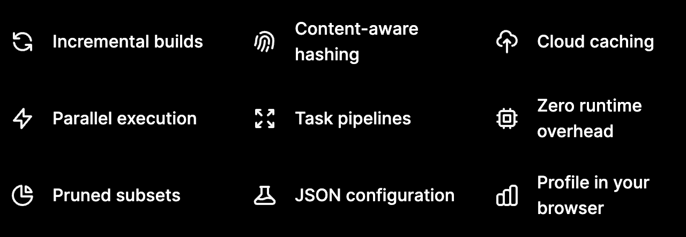

<div className="preview">
  기본적인 Turborepo사용법과 Turborepo로 개발환경 구성하기
</div>

<!--truncate-->
<!-- https://d2.naver.com/helloworld/7553804#ch4 참고 -->

## Turborepo란?

Turborepo는 대규모 모노레포 프로젝트 관리에서 오는 피로감과 부수적인 툴링에 대한 부담을 줄이면서,  
Google이나 Facebook과 같은 큰 기업에서 사용하는 수준의 개발 경험을 주는 데 포커싱한, Vercel에서  
개발 및 운영하고 있는 JavaScript/TypeScript를 위한 모노레포 빌드 시스템이다.

<br />

## Turborepo의 특징

Turborepo는 9가지 특징으로 Turborepo를 사용해야하는 이유를 설명한다.



> 참고 https://turborepo.org

<br/>

#### 1. Incremental builds

작업 진행을 캐싱해 이미 계산된 내용은 건너 뛰는 것을 의미한다.  
 `빌드는 딱 한 번만` 하는 것을 목표로 한다.

<br/>
<br/>

#### 2. Content-aware hasing

타임스탬프가 아닌 콘텐츠를 인식하는 방식으로 해싱을 지원한다.  
이를 통해 모든 파일을 다시 빌드하는 것이 아니라 `변경된 파일만 빌드` 한다.

<br />

#### 3. Cloud caching

클라우드 빌드 캐시를 팀원 및 CI/CD와 공유한다.  
이를 통해 로컬 환경을 넘어 `클라우드 환경에서도 빠른 빌드` 를 제공한다.

<br />

#### 4. Parallel execution

모든 코어를 사용하는 병렬 실행을 목표로 한다.  
지정된 태스크 단위로 의존성을 판단해 `최대한 병렬적` 으로 작업을 진행한다.

<br />

#### 5. Task Pipelines

태스크 간의 연결을 정의해서 빌드를 언제 어떻게 실행할지 판단해 최적화한다.

<br />

#### 6. Zero Runtime Overhead

런타임 코드와 소스 맵을 다루지 않기 때문에 런타임 단계에서 파악하지 못한 리스크가 불거질 위험이 없다.

<br />

#### 7. Pruned subsets

빌드에 필요한 요소만으로 모노 레포의 하위 집합을 생성해 PaaS `배포 속도를 높인다`

<br />

#### 8. JSON configuration

별도의 코드 작업 없이 JSON 설정으로 터보를 사용할 수 있다.

<br />

#### 9. Profile in browser

빌드 프로필로 빌드 과정을 시각화하면 병목 지점을 쉽게 찾을 수 있다.

<br />

## 사용하기

Turborepo를 사용해 개발환경을 구성해보자

<br/>

### 생성하기

아래 명령어로 간편하게 환경을 구성할 수 있다.

```
npx create-turbo@latest

> 선택하기
Ok to proceed? (y) y

···

? Where would you like to create your turborepo? -> 위치 입력
? Which package manager do you want to use?
  > npm
  > yarn

···

성공
>>> Success! Your new Turborepo is ready.
Inside this directory, you can run several commands:

  yarn run build
    Build all apps and packages

  yarn run dev
    Develop all apps and packages
```

<br/>

### 기본 구조

처음 생성하면 아래와 같은 구조가 나온다.

```
| // 서비스(프로젝트)가 들어간다
| apps
|   web
|   docs
|
| // 공통으로 사용될 패키지들이 들어간다
| packages
|   eslint-config-custom
|   tsconfig
|   ui
```

<br/>

### NextJs앱 추가하기

```
// NextJs workspace를 추가
cd apps
npx create-next-app --typescript [AppName]
```

<!-- 비타민 가품비율 구글링 -->
